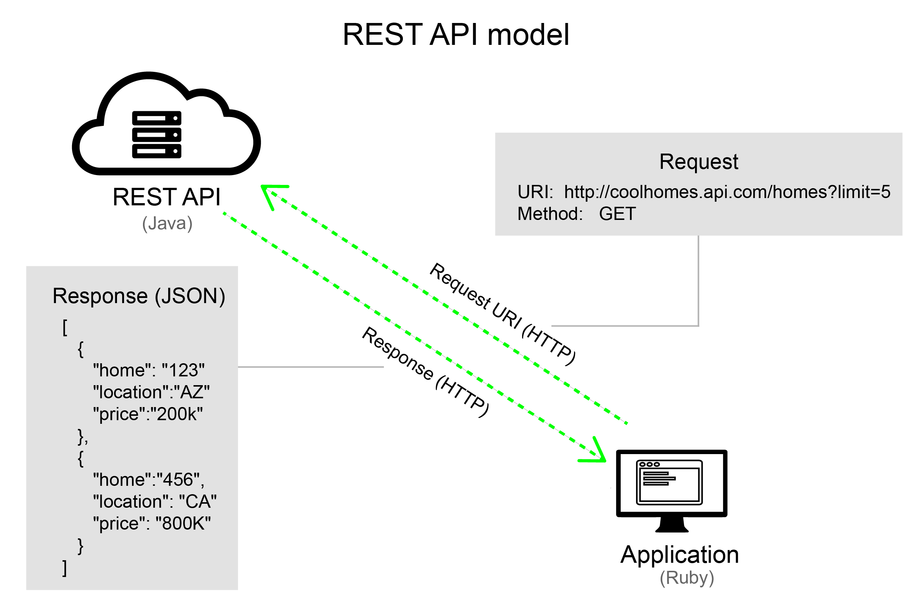

About Cal-Adapt
==================

Cal-Adapt has been designed to provide access to the wealth of data and information that has been, and continues to be, produced by State of California's scientific and research community. The data available on this site offer 
a view of how climate change might affect California at the local level. Here you can work with visualization tools, access data, and participate in community sharing to contribute your own knowledge. Cal-Adapt's development was a key recommendation of the 2009 California Climate Adaptation Strategy.

Cal-Adapt is developed by the `Geospatial Innovation Facility (GIF), UC Berkeley <http://gif.berkeley.edu/>`_ with funding and advisory oversight by the `California Energy Commission <http://www.energy.ca.gov/>`_.

Cal-Adapt API
-----------------

Cal-Adapt API (Application Programming Interface) provides programmatic access to climate data hosted on Cal-Adapt. In general, an API is like a cog that allows two systems to interact with each other, e.g. a web browser on your computer and the Cal-Adapt server.

The Cal-Adapt API is built using Django, Django REST framework, and `Django-Spillway <https://github.com/bkg/django-spillway>`_, an open source library developed at the GIF. The API follows an architectural style called REST (REpresentational State Transfer) which uses uses HTTP as the transport protocol for the message requests and responses.

What is a REST API?
---------------------

   A general model of a REST API (`source <https://idratherbewriting.com/learnapidoc/docapis_what-is-a-rest-api.html>`_)

The client (web browser, desktop GIS software, python script, etc.) sends a request to the API server for data and the server sends a response back. The client and server can be based in any language, but HTTP is the protocol used to transport the message. This request-and-response pattern is fundamentally how REST APIs work. So, when you open a browser and type a website URL (such as https://twitter.com/Cal_Adapt/status/849368048062664704), you’re actually making a GET request for a resource on Twitter's server. The server responds with the content and the browser makes the content visible.

Why did we build a public API for Cal-Adapt?
-----------------------------------------------

The Cal-Adapt API provides developers, researchers, and climate specialists with a new tool for working with the wealth of data and information that has been, and continues to be, produced by State of California's scientific and research community. The API allows users to access only the data they actually need, without having to download the entire dataset. 

It is impossible for a single organization to build tools that might satisfy every potential use of the information. With an API, other organizations will be able to easily access the data and build domain specific visualization and planning tools on top of it.

Get in Touch
---------------

Let us know how you are using the API, we would love to feature your work on our blog. If you have questions or if you would like to provide feedback please contact us at `support@cal-adapt.org <support@cal-adapt.org>`_. Thank you!

Table of Contents
------------------

.. toctree::
   :maxdepth: 2

   getting-started.rst
   data-catalog.rst
   series.rst
   tutorials.rst

